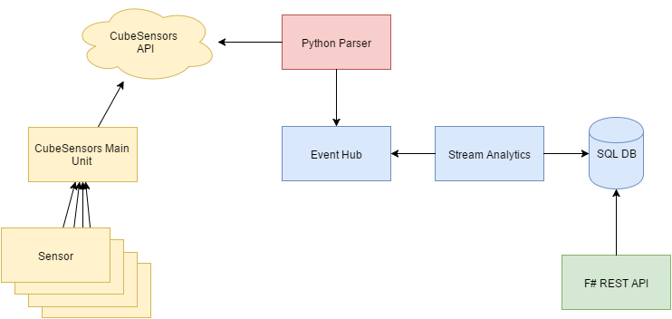

# CubeSensors IoT Azure

* src/python_parser
  * Python Parser
  * Gets data from CubeSensorsAPI, parses data to selected format and sends it to Event Hub or straight to database
* src/python_checker
  * Check sensor status from database
  * Trigger IFTTT actions
* src/CubeSensorsRestApi
  * F# REST API (Suave)
  * Gets data from database. Simple authentication.
* Azure
  * Stream Analytics fetches data from Event Hub and sends it to SQL Server.



## Azure Deployment

0. Create ServiceBus
  1. Scale -> Basic
  1. Create Event Hub
    1. Configure -> Shared access policies
      * cube_sender (Permissions: send)
      * cube_receiver (Permissions: listen)
      * Update sender private key to keys.py
0. Create SQL Database
  1. Create database
0. Create Stream Analytics
  1. Add input
    * Event Hub Policy Name: cube_receiver
  1. Add output
  1. Add query
0. Create WebApp
  1. Scale -> Basic
  1. Configuration -> Always on
  1. Add Python script (data_parser) as a new Web Job
    1. Add as a zip file. Pack whole module including env folder.

### JSON

Sample files in sample_data folder.

### Stream Analytics Query

Input: cubesensors-event-hub

Output: cubesensors-sql-data (SQL), cubesensors-alert-blob (BLOB)

```sql
WITH data_query AS (
  SELECT
      id AS sensorid,
      [time] AS measurementtime,
      temp AS temperature,
      pressure,
      humidity,
      voc,
      light,
      noisedba AS noise,
      battery,
      cable,
      voc_resistance AS vocresistance,
      rssi
  FROM
      [cubesensors-event-hub]
)

-- Addl all data to database
SELECT * INTO [cubesensors-sql-data] FROM data_query

-- Add alert data when battery is running low and cube is not plugged in
SELECT sensorid, measurementtime, battery INTO [cubesensors-alert-blob]
FROM data_query
WHERE cable = false AND battery < 10
```

### Database

Database creation scripts are in .\src\database folder. Some configurations in the beginning of the create script are required by LocalDB.

## IFTTT

TODO

